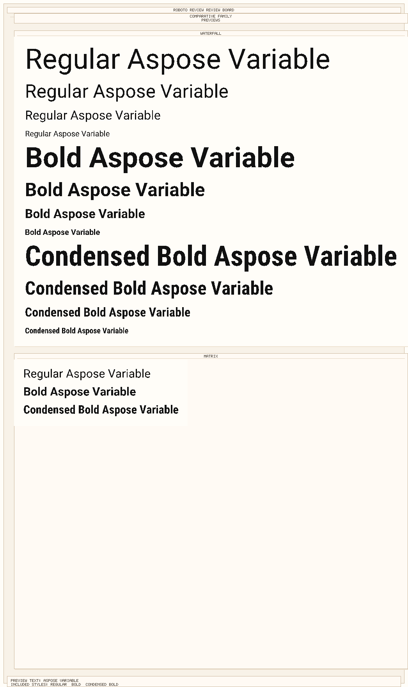
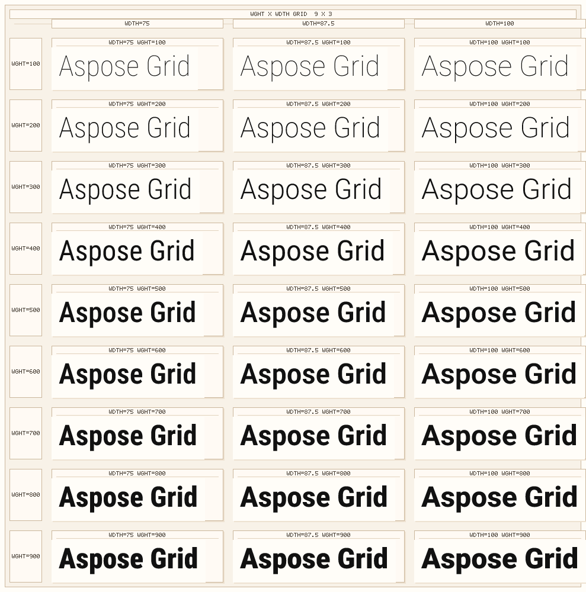
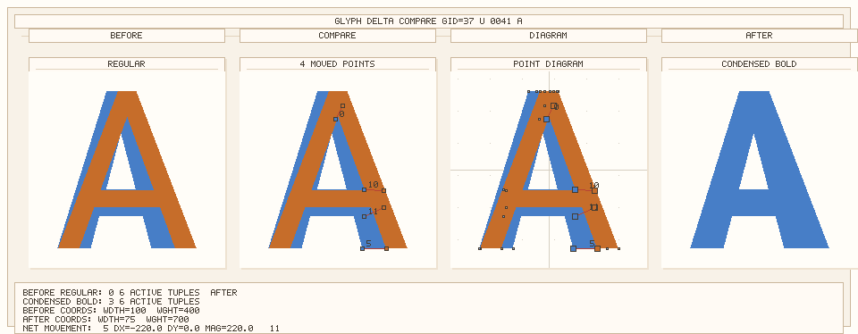
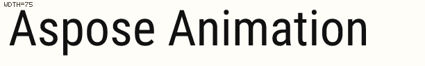

# aspose-font

A pure-Python font toolkit for reading, converting, subsetting, previewing, packaging, and QA-inspecting fonts across TrueType, OpenType, CFF, Type 1, WOFF, WOFF2, and EOT.

Public GitHub repository: [aspose-font-foss/Aspose.Font-FOSS-for-Python](https://github.com/aspose-font-foss/Aspose.Font-FOSS-for-Python)

## Why This Library

- Pure Python, with no native runtime dependencies.
- Broad format coverage for desktop and web font workflows.
- A variable-font-first product direction with instancing, previews, compatibility checks, and delta inspection.
- CLI, Python API, and MCP server surfaces for local automation and AI-assisted workflows.

## Install

```bash
pip install aspose-font
```

Install MCP support only when you want the built-in server surface:

```bash
pip install "aspose-font[mcp]"
```

## Capability Snapshot

| Area | What You Can Do Now |
| --- | --- |
| Load and inspect | Open TTF, OTF, CFF, Type 1, WOFF, WOFF2, and EOT fonts from paths, bytes, or streams; inspect names, metrics, encodings, glyphs, kerning, and loader source metadata. |
| Convert | Convert between desktop and web-facing formats in pure Python. |
| Clean metadata | Strip legacy sfnt metadata tables and old Mac `name` records before web or distribution export. |
| Subset | Build smaller fonts from text, glyph IDs, codepoints, or web-oriented preset groups including Latin, Cyrillic, Greek, Hebrew, Arabic, Devanagari, and Thai. |
| Preview | Generate PNG and SVG previews, APNG animation sweeps, scripted animation frame packages, preview batches, axis sweeps, specimen sheets, and before/after comparison boards with diff and overlay panels. |
| Variable fonts | Explore axes and named instances, resolve coordinates, suggest guided preset grids, instantiate static outputs with `HVAR`-aware widths, and auto-name exported instances with multiple naming policies plus optional custom family suffixes such as `Beta` or `Web`. |
| Web packaging | Emit WOFF2/WOFF bundles, JSON manifests, CSS, specimen HTML with reusable templates and live variable-axis sliders, navigable family packages with style filters, comparative preview artifacts, reusable family review export packs for docs and marketing handoff, variable-font subset flows that fall back to a clear static export mode when needed, explicit `auto`/`live`/`static` variable export selection, configurable naming strategies, family suffix controls, opt-in static STAT metadata, and coordinate-aware axis-grid web bundles or shared packages for custom sweeps. |
| QA workflows | Run compatibility checks with richer shape and interpolation diagnostics plus Delta Inspector reports/boards with overlay, glyph-diagram, component-aware composite diagnostics, and richer text-level comparison review cards for variable-font review. |
| Animation | Export APNG sweeps and scripted paths with presets, easing controls, baked frame captions, frame-sequence packages, presentation-ready review bundles, and showcase packages that bundle APNG, storyboard, landing HTML, and manifests for downstream sharing. |
| Automation | Use the CLI directly or expose the library through the built-in MCP server, including machine-readable variable-font compatibility reports. |

## Variable-Font-First Workflows

The current roadmap is centered on variable fonts. The strongest surface area today is the combination of:

- `font.axes`, `font.named_instances`, and `font.smart_instancer`
- `font.variable_axes` with labels, presets, and presentation metadata for common axes
- additive axis summaries such as `axis.range_summary`, `axis.default_ratio`, and preset-aware `axis.describe_value(...)`
- locale-aware axis and named-instance labels through `axis.name(...)`, `instance.name(...)`, and `var-info --language`
- ordered localization inventory through `axis.localized_labels(...)`, `instance.localized_labels(...)`, and broader common `name`-table locale coverage
- display-ready requested-language profile payloads through `axis.language_profiles(...)`, `instance.language_profiles(...)`, and `font.variable_presentation(...)`
- axis-aware named-instance coordinate labels through `instance.format_coordinates(...)` and richer `var-info` output
- JSON-ready Axes Explorer snapshots through `axis.to_presentation(...)`, `instance.to_presentation(...)`, `font.variable_presentation(...)`, and `var-info --json-output`; see `docs/variable-presentation-schema.md` for the stable integration contract
- preset-aware coordinate selection such as `wght="Bold"` or `wdth="Condensed"`
- guided axis-grid suggestions through `SmartInstancer.suggest_axis_values(...)` and preset-driven grid exports
- `HVAR`-aware static instancing so exported widths can follow horizontal metric variation data
- configurable naming strategies for generated static instances and web handoff packages, including `menu-safe` and `ribbi-safe` policies plus optional custom family suffixes and explicit family/style overrides for safer app/menu coexistence and release-channel labeling
- high-level previews through `FontPreviewBuilder`
- web handoff packaging through `WebFontBuilder`, `SmartInstancer.build_web_bundle(...)`, axis-grid web bundles, and coordinate-aware shared grid-family packages
- QA tooling through `CompatibilityChecker` and `DeltaInspector`
- deeper compatibility issue notes for segment mix, control points, contour closure, and endpoint movement
- additive interpolation diagnostics for active `gvar` tuple changes between compared instance states

## Quick Start

```python
from aspose_font import FontLoader, FontType
from aspose_font.converter import FontConverter

font = FontLoader.open("Roboto.ttf")
print(font.font_name, font.num_glyphs)

woff2 = FontConverter.convert(font, FontType.WOFF2)
with open("Roboto.woff2", "wb") as f:
    f.write(woff2.to_bytes())
```

For a friendlier loader result surface with source metadata and variable/static helpers:

```python
from pathlib import Path
import io

from aspose_font import FontLoader

loaded = FontLoader.load(Path("Roboto-VariableFont_wdth,wght.ttf"))
print(loaded.source.kind, loaded.source.label, loaded.is_variable)

blob = Path("Roboto-VariableFont_wdth,wght.ttf").read_bytes()
loaded_bytes = FontLoader.load(blob)
print(loaded_bytes.source.kind, loaded_bytes.source.size)

loaded_stream = FontLoader.load(io.BytesIO(blob))
print(loaded_stream.source.kind, loaded_stream.is_static)
```

## Real Example Results

These examples mirror the generated demo site and use the same fixture-backed flows.

### Variable Font Discovery

```python
from aspose_font import FontLoader

font = FontLoader.open("Roboto-VariableFont_wdth,wght.ttf")
print(font.is_variable)
print([axis.tag for axis in font.axes])
print(len(font.named_instances))
print(font.get_axis("wght").get_preset("Bold").value)
print(font.smart_instancer.resolve({"wght": "Bold", "wdth": "Condensed"}).label)
print(font.smart_instancer.suggest_axis_values("wght", include_bounds=True))
print(font.get_axis("wght").name(("fr-CA", "en")))
print(font.get_axis("wght").range_summary)
print(font.get_named_instance("Condensed Bold").format_coordinates(font.variable_axes, include_tags=True))
print(font.get_axis("wght").localized_labels(("pt-PT", "fr-CA")))
print(font.variable_presentation(preferred_languages=("en",))["axes"][0]["range_summary"])
print(font.variable_presentation(preferred_languages=("fr-CA", "en"))["axes"][0]["language_profiles"][0])
```

```text
is_variable = True
axes = ['wght', 'wdth']
named_instances = 18
bold_preset = 700.0
preset_resolve = Condensed Bold
suggested_wght = [100.0, 200.0, 300.0, 400.0, 500.0, 600.0, 700.0, 800.0, 900.0]
localized_axis_name = Weight
weight_range_summary = 100 -> 900 (default: Regular (400))
condensed_bold_coordinates = ('Width [wdth]=Condensed (75%)', 'Weight [wght]=Bold (700)')
ordered_localizations = (('en', 'Weight'),)
presentation_snapshot_range = 100 -> 900 (default: Regular (400))
language_profile = {'requested_language': 'fr-ca', 'display_label': 'Weight', 'resolved_language': 'en', 'fallback_reason': 'english-fallback', 'has_requested_language_label': False}
```

### Family Review Board

```python
from aspose_font import FontLoader

font = FontLoader.open("Roboto-VariableFont_wdth,wght.ttf")
board = font.smart_instancer.build_family_review_board(
    ["Bold", "Condensed Bold"],
    include_default=True,
    text="Aspose Variable",
    family_name="Roboto Review",
)
board.write_to("roboto-family-review-board.png")
```

```text
filename = family-review-board.png
media_type = image/png
styles = Default, Bold, Condensed Bold
```



```python
export_pack = font.smart_instancer.build_family_review_export_package(
    ["Bold", "Condensed Bold"],
    include_default=True,
    text="Aspose Variable",
    family_name="Roboto Review",
)
export_pack.write_to("roboto-review-export")
```

### Axis Grid Preview

```python
from aspose_font import FontLoader

font = FontLoader.open("Roboto-VariableFont_wdth,wght.ttf")
grid = font.smart_instancer.build_axis_grid_sheet(
    "wght",
    secondary_axis_tag="wdth",
    use_axis_presets=True,
    use_secondary_axis_presets=True,
    text="Aspose Grid",
    size=48,
    file_stem="roboto-axis-grid",
)
grid.write_to("roboto-axis-grid.png")
```

```text
filename = roboto-axis-grid.png
media_type = image/png
axes = wght x wdth
presets = Weight and Width
```



### Delta Comparison Report

```python
from aspose_font import FontLoader

font = FontLoader.open("Roboto-VariableFont_wdth,wght.ttf")
report = font.smart_instancer.compare_delta_glyph(
    codepoint=ord("A"),
    before_instance_name="Regular",
    after_instance_name="Condensed Bold",
)
print(report.is_comparable, report.moved_point_count)
```

```text
is_comparable = True
moved_point_count = 4
```



### Variable Font Animation Export

```bash
uv run aspose-font preview-animation testdata/Roboto-VariableFont_wdth,wght.ttf test.png --axis wdth --start 75 --end 100 --bounce
uv run aspose-font preview-animation-path testdata/Roboto-VariableFont_wdth,wght.ttf story.png --state Regular --state "wght=700,wdth=75" --state Bold --preset showcase
uv run aspose-font preview-animation-path-package testdata/Roboto-VariableFont_wdth,wght.ttf story-package --state Regular --state "wght=700,wdth=75" --state Bold --preset draft
uv run aspose-font preview-animation-path-review testdata/Roboto-VariableFont_wdth,wght.ttf story-review --state Regular --state "wght=700,wdth=75" --state Bold --preset draft
uv run aspose-font preview-animation-path-showcase testdata/Roboto-VariableFont_wdth,wght.ttf story-showcase --state Regular --state "wght=700,wdth=75" --state Bold --preset showcase
```

```python
from aspose_font import FontLoader
from aspose_font.animation import AnimationPreviewBuilder

font = FontLoader.open("Roboto-VariableFont_wdth,wght.ttf")
animation = AnimationPreviewBuilder.build_axis_sweep(
    font,
    axis_tag="wdth",
    start_val=75.0,
    end_val=100.0,
    text="Aspose Animation",
    preset="showcase",
)
animation.write_to("roboto-sweep.png")

story = AnimationPreviewBuilder.build_named_instance_path(
    font,
    ["Regular", "Condensed Bold", "Bold"],
    text="Aspose Animation",
    frames_per_segment=10,
    preset="draft",
)
story.write_to("roboto-story.png")

package = AnimationPreviewBuilder.build_path_package(
    font,
    [
        {"wght": 400.0, "wdth": 100.0},
        {"wght": 700.0, "wdth": 75.0},
        {"wght": 700.0, "wdth": 100.0},
    ],
    text="Aspose Animation",
    preset="draft",
)
package.write_to("roboto-story-package")

review = AnimationPreviewBuilder.build_path_review_package(
    font,
    [
        {"wght": 400.0, "wdth": 100.0},
        {"wght": 700.0, "wdth": 75.0},
        {"wght": 700.0, "wdth": 100.0},
    ],
    text="Aspose Animation",
    preset="draft",
)
review.write_to("roboto-story-review")

showcase = AnimationPreviewBuilder.build_path_showcase_package(
    font,
    [
        {"wght": 400.0, "wdth": 100.0},
        {"wght": 700.0, "wdth": 75.0},
        {"wght": 700.0, "wdth": 100.0},
    ],
    text="Aspose Animation",
    preset="showcase",
)
showcase.write_to("roboto-story-showcase")
```

```text
filename = roboto-sweep.png
media_type = image/apng
frames = 29
bytes = 38944
available_presets = ('draft', 'standard', 'showcase')
```



## Python API Highlights

```python
from aspose_font import FontLoader, FontPreviewBuilder, WebFontBuilder
from aspose_font import FontCleaner
from aspose_font.subsetter import FontSubsetter

font = FontLoader.open("Roboto-VariableFont_wdth,wght.ttf")

subset_result = FontSubsetter.subset_for_web_with_coverage(
    font,
    presets=("latin", "arabic"),
    text="Aspose مرحبا",
)
print(subset_result.font.num_glyphs)
print(subset_result.coverage.covered_count, subset_result.coverage.missing_codepoints)

preview = FontPreviewBuilder.build(font, instance_name="Bold", text="Preview")
preview.write_to("preview.png")

svg_preview = FontPreviewBuilder.build(
    font,
    instance_name="Bold",
    text="Preview",
    output_format="svg",
)
svg_preview.write_to("preview.svg")

instanced = font.smart_instancer.instantiate(
    {"wght": "Bold", "wdth": "Condensed"},
    naming_strategy="ribbi-safe",
    family_suffix="Beta",
)
print(instanced.font_family, instanced.font_style, instanced.ttf_tables.name.get(17))

menu_named = font.instantiate(
    {"wght": 700, "wdth": 75},
    naming_strategy="ribbi-safe",
    legacy_family_name="Acme Sans Menu",
    typographic_family_name="Acme Sans Pro",
    stat_policy="static",
)
print(menu_named.ttf_tables.name.get(1), menu_named.ttf_tables.name.get(16))
print("STAT" in menu_named.ttf_tables._raw)

preview = font.preview_naming_policy(
    {"wght": 700, "wdth": 75},
    naming_strategy="ribbi-safe",
    stat_policy="static",
)
print(preview.stat_diagnostics.generated_stat_axis_value_flags)

cleaned = FontCleaner.clean_for_web(font)
print("meta" in cleaned.ttf_tables._raw)

compat = font.smart_instancer.check_compatibility(
    before_instance_name="Regular",
    after_instance_name="Condensed Bold",
    text="Aspose",
)
print(compat.is_compatible, len(compat.issues))

delta = font.smart_instancer.inspect_deltas(
    instance_name="Bold",
    codepoint=ord("A"),
)
print(delta.total_tuple_count, len(delta.active_tuples))

text_compare = font.smart_instancer.compare_delta_text(
    text="Aspose",
    before_instance_name="Regular",
    after_instance_name="Condensed Bold",
)
print(text_compare.moved_glyph_count, text_compare.comparable_glyph_count)

bundle = font.smart_instancer.build_web_bundle(
    instance_name="Bold",
    family_suffix="Beta",
    include_woff=False,
    preview_text="Aspose Variable",
)
bundle.write_to("web-out")

subset_bundle = WebFontBuilder.build(
    font,
    presets=("latin", "arabic"),
    text="Aspose",
    include_woff=False,
)
print(subset_bundle.manifest["export_mode"])
print(subset_bundle.manifest["subset"]["coverage"]["missing_count"])

live_bundle = WebFontBuilder.build(
    font,
    include_woff=False,
    variable_mode="live",
)
print(live_bundle.manifest["requested_variable_mode"], live_bundle.manifest["export_mode"])

static_stat_bundle = WebFontBuilder.build(
    font,
    include_woff=False,
    variable_mode="static",
    instance_name="Bold",
    stat_policy="static",
)
print(static_stat_bundle.manifest["requested_stat_policy"])

grid_package = font.smart_instancer.build_axis_grid_web_family_package(
    "wght",
    [400.0, 700.0],
    family_name="Roboto Grid",
    include_woff=False,
    preview_text="Grid Family",
    naming_strategy="preserve-family",
)
grid_package.write_to("web-grid-family")
print(grid_package.manifest["bundles"][1]["review_label"])
```

The generated grid-family package links back to the demo-site direction: `family.html` shows
coordinate labels like `wdth=100 wght=700`, while `family-manifest.json` exposes the same
`review_label` and `instance_coordinates` fields for automation.

## CLI Highlights

```bash
# General inspection and conversion
aspose-font info Roboto.ttf
aspose-font convert Roboto.ttf Roboto.woff2 --to woff2
aspose-font meta-clean Roboto.ttf Roboto-clean.ttf

# Variable-font previews and review boards
aspose-font preview Roboto-VariableFont_wdth,wght.ttf preview.svg --instance-name Bold --format svg
aspose-font var-instance Roboto-VariableFont_wdth,wght.ttf bold-condensed.ttf --instance wght=Bold --instance wdth=Condensed
aspose-font var-instance Roboto-VariableFont_wdth,wght.ttf condensed-bold.ttf --instance-name condensedbold
aspose-font var-instance Roboto-VariableFont_wdth,wght.ttf qa-bold.ttf --instance-name Bold --naming-strategy qa-tagged
aspose-font var-instance Roboto-VariableFont_wdth,wght.ttf menu-safe-bold.ttf --instance-name Bold --naming-strategy menu-safe
aspose-font var-instance Roboto-VariableFont_wdth,wght.ttf ribbi-safe-bold.ttf --instance-name "Condensed Bold" --naming-strategy ribbi-safe
aspose-font var-instance Roboto-VariableFont_wdth,wght.ttf beta-bold.ttf --instance-name Bold --naming-strategy instance-family --family-suffix Beta
aspose-font var-instance Roboto-VariableFont_wdth,wght.ttf acme-bold.ttf --instance-name "Condensed Bold" --naming-strategy ribbi-safe --legacy-family-name "Acme Sans Menu" --typographic-family-name "Acme Sans Pro"
aspose-font var-instance Roboto-VariableFont_wdth,wght.ttf acme-display.ttf --instance-name "Condensed Bold" --naming-strategy ribbi-safe --legacy-style-name Bold --typographic-style-name "Condensed Display Bold"
aspose-font var-instance Roboto-VariableFont_wdth,wght.ttf bold-stat.ttf --instance-name Bold --stat-policy static
aspose-font var-naming-preview Roboto-VariableFont_wdth,wght.ttf --instance-name Bold --stat-policy static --json-output naming-preview.json
aspose-font var-info Roboto-VariableFont_wdth,wght.ttf
aspose-font var-info Roboto-VariableFont_wdth,wght.ttf --language fr-CA --language en
aspose-font var-info Roboto-VariableFont_wdth,wght.ttf --json-output variable-presentation.json
aspose-font preview-grid-sheet Roboto-VariableFont_wdth,wght.ttf grid-sheet.png --axis wght --use-presets
aspose-font preview-compare Roboto-VariableFont_wdth,wght.ttf compare.png --before-instance-name Regular --after-instance-name "Condensed Bold"
aspose-font preview-waterfall Roboto-VariableFont_wdth,wght.ttf waterfall.png --instance-name Bold --instance-name "Condensed Bold" --include-default
aspose-font preview-matrix Roboto-VariableFont_wdth,wght.ttf matrix.png --all-named
aspose-font preview-family-board Roboto-VariableFont_wdth,wght.ttf family-review-board.png --instance-name Bold --instance-name "Condensed Bold" --include-default
aspose-font preview-family-export Roboto-VariableFont_wdth,wght.ttf family-review-export --instance-name Bold --include-default --family-name "Roboto Review"
aspose-font web-grid-family Roboto-VariableFont_wdth,wght.ttf grid-family --axis wght --use-presets --axis2 wdth --use-secondary-presets --no-woff

# QA tooling
aspose-font var-compat Roboto-VariableFont_wdth,wght.ttf --before-instance-name Regular --after-instance-name "Condensed Bold" --text Aspose
aspose-font var-compat Roboto-VariableFont_wdth,wght.ttf --before-instance-name Regular --after-instance-name "Condensed Bold" --text Aspose --json-output compat-report.json
aspose-font var-delta Roboto-VariableFont_wdth,wght.ttf --instance-name Bold --char A
aspose-font var-delta-text Roboto-VariableFont_wdth,wght.ttf --instance-name Bold --text "Aspose"
aspose-font var-delta-text-compare Roboto-VariableFont_wdth,wght.ttf --before-instance-name Regular --after-instance-name "Condensed Bold" --text "Aspose"
aspose-font var-delta-text-compare-board Roboto-VariableFont_wdth,wght.ttf delta-text-compare.png --before-instance-name Regular --after-instance-name "Condensed Bold" --text "Aspose"
aspose-font var-delta-compare Roboto-VariableFont_wdth,wght.ttf --before-instance-name Regular --after-instance-name "Condensed Bold" --char A

# Web packaging
aspose-font web-build Roboto-VariableFont_wdth,wght.ttf web-out --instance-name Bold --template editorial --no-woff
aspose-font web-build Roboto-VariableFont_wdth,wght.ttf web-beta --instance-name Bold --family-suffix Beta --no-woff
aspose-font web-build Roboto-VariableFont_wdth,wght.ttf web-static-stat --variable-mode static --instance-name Bold --stat-policy static --no-woff
aspose-font web-family Roboto-VariableFont_wdth,wght.ttf family-out --instance-name Bold --naming-strategy preserve-family --no-woff
aspose-font web-grid Roboto-VariableFont_wdth,wght.ttf grid-web --axis wght --use-presets --no-woff
aspose-font web-grid-family Roboto-VariableFont_wdth,wght.ttf grid-family --axis wght --use-presets --family-name "Roboto Grid" --no-woff
```

## MCP Server

Expose the library to AI clients and local toolchains:

```bash
pip install "aspose-font[mcp]"
python -m aspose_font.mcp
```

The MCP server now covers low-level inspection tools, machine-readable variable-font compatibility
reports through `var_compat`, and high-level web export workflows including single-bundle web
packaging and shared family-package generation.

## Development

```bash
uv run python -m pytest tests/ -q
uv run --with ruff ruff check src tests setup.py
uv run --with build python -m build
```

These verification flows also refresh the generated demo site content.

## License

[MIT](./LICENSE.txt)
