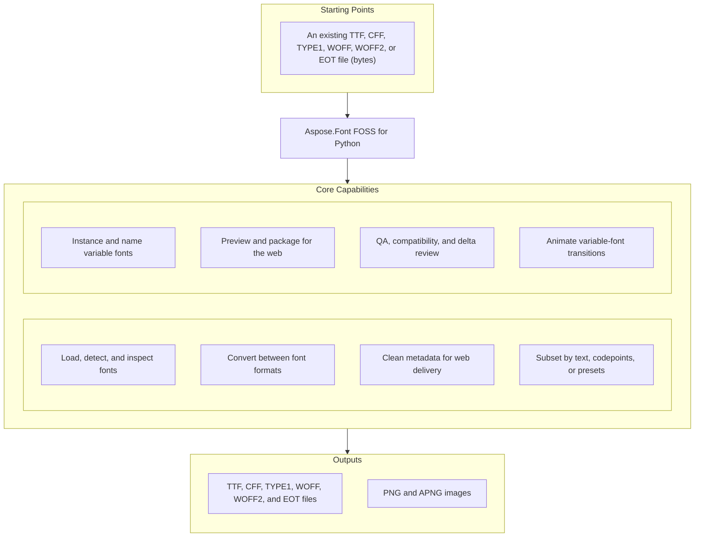
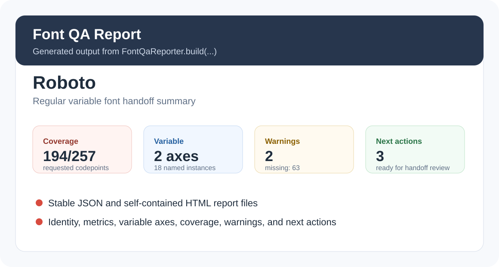

# Aspose.Font FOSS for Python

[](LICENSE.txt) [](pyproject.toml) [](https://github.com/aspose-font-foss/Aspose.Font-FOSS-for-Python/graphs/contributors)

[](https://products.aspose.org/font/python/)

Aspose.Font FOSS for Python is a free, open-source, pure-Python library for loading, inspecting,
converting, and subsetting TrueType (TTF), OpenType (OTF), CFF, Type 1, WOFF, WOFF2, and EOT
fonts, with zero required third-party runtime dependencies — font workflow automation for teams
that need to prepare, review, package, and explain fonts without native runtime dependencies.
Beyond format conversion, it adds variable-font instancing, visual previews, web-font packaging,
and QA/compatibility reporting — all built on the same `Font` object returned by
`FontLoader.open()` — and is usable from Python, the bundled `aspose-font` command-line tool, or
an optional MCP server for AI tooling.

## Navigation

- [At a Glance](#at-a-glance)
- [Key Capabilities](#key-capabilities)
- [Installation](#installation)
- [Dependencies](#dependencies)
- [Quick Start](#quick-start)
- [Additional Examples](#additional-examples)
- [API Reference](#api-reference)
- [Documentation & Resources](#documentation--resources)
- [Scope and Limitations](#scope-and-limitations)
- [Development and Testing](#development-and-testing)
- [License](#license)

## At a Glance



## Key Capabilities

- Load, auto-detect, and inspect TrueType (TTF), OpenType (OTF), CFF, Type 1, WOFF, WOFF2, and
  EOT fonts from a file path, raw bytes, or a stream with `FontLoader.open()`/`FontLoader.load()`
  — magic-byte detection picks the format automatically unless you pass `font_type` explicitly.
- Read font metadata, metrics, encodings, glyph outlines, and kerning through the shared `Font`
  base class and its collaborators (`font_name`, `font_family`, `FontMetrics`, `FontEncoding`,
  `GlyphAccessor`, `KernPair`) without parsing binary tables by hand.
- Convert between formats with the `font.convert(target)` instance method, or the equivalent
  `FontConverter.convert(font, target)` (`from aspose_font.converter import FontConverter`) —
  TTF/OTF/CFF to WOFF or WOFF2, WOFF/WOFF2 back to TTF, EOT to its wrapped TTF/OTF payload and
  back, and Type 1 to TTF or CFF — each pairing backed by a real, tested conversion path.
- Strip legacy sfnt metadata and old Mac `name` records for web delivery with
  `FontCleaner.clean_for_web()`, with independent opt-outs for Mac names, legacy tables (`DSIG`),
  and metadata tables (`FFTM`, `meta`).
- Subset fonts by Unicode text, glyph ID, or codepoint list with `FontSubsetter`, including
  web-oriented preset groups (Latin, Cyrillic, Greek, Hebrew, Arabic, Devanagari, Thai) and
  Unicode-coverage diagnostics via `SubsetCoverage`.
- Explore and instantiate variable fonts through `font.axes`, `font.named_instances`, and
  `font.smart_instancer` (`SmartInstancer`) — resolve named-instance coordinates, get
  `HVAR`-aware axis-grid suggestions, and produce static instances with configurable naming
  strategies (`menu-safe`, `ribbi-safe`), optional custom family suffixes such as `Beta` or
  `Web`, and optional STAT metadata.
- Render PNG and SVG previews with `FontPreviewBuilder`, plus preview batches, axis-grid sheets,
  waterfall and matrix specimen sheets, before/after comparison boards, and family review boards
  from the CLI and `SmartInstancer`; animate variable fonts with `AnimationPreviewBuilder` — APNG
  axis sweeps and scripted multi-state paths with presets, easing controls, and baked frame
  captions, delivered as single files, frame-sequence packages, review bundles, or showcase
  packages that bundle the APNG, a storyboard, landing HTML, and manifests.
- Package browser-ready web-font bundles (WOFF2/WOFF, CSS, specimen HTML, JSON manifests) with
  `WebFontBuilder` and `SmartInstancer.build_web_bundle()` — choosing `auto`, `live`, or `static`
  variable export explicitly, or letting a subset request fall back to a static export when it
  must — and navigable family packages and axis-grid family packages for handoff.
- Generate Font QA Reports, variable-font compatibility checks, and glyph delta/interpolation
  diagnostics — compatibility issue notes for segment mix, control points, contour closure, and
  endpoint movement, plus active `gvar` tuple-variation changes between compared instance states
  — with `FontQaReporter`, `CompatibilityChecker`, and `DeltaInspector`.
- Automate any of the above from the command line with the bundled `aspose-font` CLI, suited to
  local scripts or CI pipelines, or expose the same library to AI tooling through the optional
  built-in MCP server.

## Installation

Aspose.Font FOSS for Python has not yet been published to a package registry. Install it directly
from a checkout of the repository for now:

```bash
git clone https://github.com/aspose-font-foss/Aspose.Font-FOSS-for-Python.git
cd Aspose.Font-FOSS-for-Python
pip install .
```

The distribution name is `aspose-font` (declared in `pyproject.toml`); once published this will
become `pip install aspose-font`. It requires Python 3.10 or later and has no required
third-party runtime dependencies.

Verify the install:

```bash
python -c "import aspose_font; print('aspose_font OK')"
```

Install MCP server support only if you want the built-in [Model Context
Protocol](https://modelcontextprotocol.io/) server surface; the bundled server is written against
the `mcp` 1.x `FastMCP` API, so pin `mcp<2.0`:

```bash
pip install ".[mcp]" "mcp<2.0"
```

## Dependencies

### Required Package Dependencies

No required third-party package dependencies.

### Optional Dependencies

- `mcp` (`>=1.0`) — the optional `mcp` extra that enables the built-in MCP server surface; see
  [Installation](#installation) above for how to enable it and the `mcp<2.0` pin.

### Native and System Requirements

- Requires Python 3.10 or later (`pyproject.toml`'s `requires-python`).
- No native system libraries: WOFF2's Brotli compression is handled by a vendored,
  pure-Python codec (`aspose_font._brotli`), not an external C library or OS-level package.

### Development Dependencies

- `pytest` `>=7.4` — test suite runner (`pip install -e ".[dev]"`; `uv`'s own
  `dependency-groups.dev` pins `pytest>=9.0.2` for `uv run`/`uv sync` workflows).
- `ruff` `>=0.4` — linter.
- `build` `>=1.2` — builds the wheel/sdist for release.

## Quick Start

Load a font and inspect its metadata:

```python
from aspose_font import FontLoader

font = FontLoader.open("Roboto-Regular.ttf")
print(font.font_name)      # e.g. "Roboto"
print(font.font_family)    # e.g. "Roboto"
print(font.num_glyphs)
print(font.metrics.units_per_em, font.metrics.ascender, font.metrics.descender)
```

Clean it for the web and convert it to WOFF2:

```python
from aspose_font import FontLoader, FontCleaner
from aspose_font.converter import FontConverter
from aspose_font import FontType

font = FontLoader.open("Roboto-Regular.ttf")
cleaned = FontCleaner.clean_for_web(font)          # drops DSIG/FFTM/meta and Mac name records
woff2_font = FontConverter.convert(cleaned, FontType.WOFF2)
open("roboto.woff2", "wb").write(woff2_font.to_bytes())
```

## Additional Examples

These real outputs mirror the fixture-backed examples generated for the demo site, starting with
a web package handoff and continuing through QA, review, and animation workflows below.

Build a browser-ready web-font package with `WebFontBuilder`, including CSS, an HTML specimen
page, and a JSON manifest:

```python
from aspose_font import FontLoader, WebFontBuilder

font = FontLoader.open("Roboto-VariableFont_wdth,wght.ttf")
bundle = WebFontBuilder.build(
    font,
    presets=("latin",),
    text="Aspose Web",
    variable_mode="auto",
    include_woff=False,
)
bundle.write_to("web-out")
print(bundle.manifest["export_mode"])
print(bundle.manifest["subset"]["coverage"]["covered_count"])
```

The package folder holds the browser-ready files plus machine-readable evidence:

```text
web-out/
  roboto-instance-bold.woff2
  roboto-instance-bold.css
  roboto-instance-bold.html
  web-manifest.json
```

The manifest records the resolved export mode, source/output variable status, Unicode-coverage
diagnostics, naming choices, and STAT-policy guidance when applicable. Equivalent CLI:

```bash
aspose-font web-build Roboto-VariableFont_wdth,wght.ttf web-out --preset latin --text "Aspose Web" --variable-mode auto --no-woff
```

<details>
<summary>View Additional Examples</summary>

### Generate a Font QA Report Package

`FontQaReporter.build_package(...)` (or `qa-report --package-output` from the CLI) produces a
review folder with JSON, HTML, and a preview PNG:

```python
from aspose_font import FontLoader, FontQaReporter

font = FontLoader.open("Roboto-VariableFont_wdth,wght.ttf")
package = FontQaReporter.build_package(
    font,
    "qa-package",
    presets=("latin",),
    text="Aspose QA",
    preview_instance_name="Bold",
)
print(package.json_path)
print(package.html_path)
print(package.preview_path)
```

```text
qa-package/
  qa-report.json
  qa-report.html
  preview.png
```

Equivalent CLI:

```bash
aspose-font qa-report Roboto-VariableFont_wdth,wght.ttf --preset latin --text "Aspose QA" --package-output qa-package --preview-instance-name Bold
```



`FontQaReporter.build(...)` returns the report object itself when you only need the HTML (or the
JSON) rather than the whole package folder:

```python
qa_report = FontQaReporter.build(
    font,
    presets=("latin",),
    text="Aspose QA",
)
qa_report.write_html("font-qa-report.html")
```

### Create a Release-Safe Static Instance

`font.smart_instancer.instantiate(...)` resolves preset names or raw axis values into a static
`TtfFont`, with `HVAR`-aware widths and configurable naming policies:

```python
from aspose_font import FontLoader

font = FontLoader.open("Roboto-VariableFont_wdth,wght.ttf")
instance = font.smart_instancer.instantiate(
    {"wght": "Bold", "wdth": "Condensed"},
    naming_strategy="ribbi-safe",
    family_suffix="Beta",
    stat_policy="static",
)
instance.save("roboto-beta-bold.ttf")
```

The generated name records are readable from the resulting font's own `name` table:

```python
instanced = font.smart_instancer.instantiate(
    {"wght": "Bold", "wdth": "Condensed"},
    naming_strategy="ribbi-safe",
    family_suffix="Beta",
)
print(instanced.font_family, instanced.font_style, instanced.ttf_tables.name.get(17))
```

### Build a Variable Instance Review Board

Generate an approval-ready board comparing several named instances side by side:

```python
from aspose_font import FontLoader

font = FontLoader.open("Roboto-VariableFont_wdth,wght.ttf")
board = font.smart_instancer.build_family_review_board(
    ["Bold", "Condensed Bold"],
    include_default=True,
    text="Aspose Variable",
    family_name="Roboto Review",
)
board.write_to("roboto-family-review-board.png")
```


### Show an Axis Grid Proof

See how a variable font behaves across weight and width in one sheet:

```python
from aspose_font import FontLoader

font = FontLoader.open("Roboto-VariableFont_wdth,wght.ttf")
grid = font.smart_instancer.build_axis_grid_sheet(
    "wght",
    secondary_axis_tag="wdth",
    use_axis_presets=True,
    use_secondary_axis_presets=True,
    text="Aspose Grid",
    size=48,
    file_stem="roboto-axis-grid",
)
grid.write_to("roboto-axis-grid.png")
```


### Compare Delta and Compatibility Evidence

Inspect how outlines change between two variable-font instances, and how compatible they are:

```python
from aspose_font import FontLoader

font = FontLoader.open("Roboto-VariableFont_wdth,wght.ttf")
report = font.smart_instancer.compare_delta_glyph(
    codepoint=ord("A"),
    before_instance_name="Regular",
    after_instance_name="Condensed Bold",
)
print(report.is_comparable, report.moved_point_count)

compat = font.smart_instancer.check_compatibility(
    before_instance_name="Regular",
    after_instance_name="Condensed Bold",
    text="Aspose",
)
print(compat.is_compatible, len(compat.issues))
```

```text
is_comparable = True
moved_point_count = 4
```

`inspect_deltas(...)` reports which `gvar` tuple variations are active for one glyph at a given
instance, and `compare_delta_text(...)` scores a whole string between two instances:

```python
delta = font.smart_instancer.inspect_deltas(
    instance_name="Bold",
    codepoint=ord("A"),
)
print(delta.total_tuple_count, len(delta.active_tuples))

text_compare = font.smart_instancer.compare_delta_text(
    text="Aspose",
    before_instance_name="Regular",
    after_instance_name="Condensed Bold",
)
print(text_compare.moved_glyph_count, text_compare.comparable_glyph_count)
```


### Generate Animation and Showcase Assets

Create an animated APNG that sweeps a variable-font axis from a start to an end value:

```python
from aspose_font import FontLoader, AnimationPreviewBuilder

font = FontLoader.open("Roboto-VariableFont_wdth,wght.ttf")
asset = AnimationPreviewBuilder.build_axis_sweep(
    font,
    axis_tag="wdth",
    start_val=75.0,
    end_val=100.0,
    frames=3,
    fps=10,
    text="A",
    size=10.0,
    bounce=True,
)
asset.write_to("roboto-sweep-wdth.png")
```

Equivalent CLI, plus a scripted multi-state path variant:

```bash
aspose-font preview-animation Roboto-VariableFont_wdth,wght.ttf sweep.png --axis wdth --start 75 --end 100 --bounce
aspose-font preview-animation-path-showcase Roboto-VariableFont_wdth,wght.ttf story-showcase --state Regular --state "wght=700,wdth=75" --state Bold --preset showcase
```


### Variable Font Discovery: Axes, Named Instances, and Localized Labels

Axes, named instances, preset resolution, guided axis-grid suggestions
(`SmartInstancer.suggest_axis_values(...)`), locale-aware labels (`axis.name(...)`,
`axis.localized_labels(...)`), axis-aware coordinate labels (`instance.format_coordinates(...)`),
and the JSON-ready presentation snapshot (`font.variable_presentation(...)`, with per-language
`language_profiles`) all hang off the loaded font:

```python
from aspose_font import FontLoader

font = FontLoader.open("Roboto-VariableFont_wdth,wght.ttf")
print(font.is_variable)
print([axis.tag for axis in font.axes])
print(len(font.named_instances))
print(font.get_axis("wght").get_preset("Bold").value)
print(font.smart_instancer.resolve({"wght": "Bold", "wdth": "Condensed"}).label)
print(font.smart_instancer.suggest_axis_values("wght", include_bounds=True))
print(font.get_axis("wght").name(("fr-CA", "en")))
print(font.get_axis("wght").range_summary)
print(font.get_named_instance("Condensed Bold").format_coordinates(font.variable_axes, include_tags=True))
print(font.get_axis("wght").localized_labels(("pt-PT", "fr-CA")))
print(font.variable_presentation(preferred_languages=("en",))["axes"][0]["range_summary"])
print(font.variable_presentation(preferred_languages=("fr-CA", "en"))["axes"][0]["language_profiles"][0])
```

```text
is_variable = True
axes = ['wght', 'wdth']
named_instances = 18
bold_preset = 700.0
preset_resolve = Condensed Bold
suggested_wght = [100.0, 200.0, 300.0, 400.0, 500.0, 600.0, 700.0, 800.0, 900.0]
localized_axis_name = Weight
weight_range_summary = 100 -> 900 (default: Regular (400))
condensed_bold_coordinates = ('Width [wdth]=Condensed (75%)', 'Weight [wght]=Bold (700)')
ordered_localizations = (('en', 'Weight'),)
presentation_snapshot_range = 100 -> 900 (default: Regular (400))
language_profile = {'requested_language': 'fr-ca', 'display_label': 'Weight', 'resolved_language': 'en', 'fallback_reason': 'english-fallback', 'has_requested_language_label': False}
```

Each `VariableAxis` also exposes additive summaries (`axis.range_summary`, `axis.default_ratio`,
the preset-aware `axis.describe_value(...)`), and every axis and named instance carries the same
locale-aware surface — `axis.name(...)`/`instance.name(...)`, ordered
`axis.localized_labels(...)`/`instance.localized_labels(...)` inventories, and
`axis.language_profiles(...)`/`instance.language_profiles(...)` payloads — plus
`axis.to_presentation(...)`/`instance.to_presentation(...)` snapshots for Axes Explorer-style
UIs. The same JSON payload is available from the CLI as `var-info --json-output`, and
`var-info --language` applies the locale preference.

### Render PNG and SVG Previews

`FontPreviewBuilder.build(...)` renders a text sample at a named instance to a `PreviewImage`;
`output_format="svg"` switches the output from PNG to SVG:

```python
from aspose_font import FontLoader, FontPreviewBuilder

font = FontLoader.open("Roboto-VariableFont_wdth,wght.ttf")

preview = FontPreviewBuilder.build(font, instance_name="Bold", text="Preview")
preview.write_to("preview.png")

svg_preview = FontPreviewBuilder.build(
    font,
    instance_name="Bold",
    text="Preview",
    output_format="svg",
)
svg_preview.write_to("preview.svg")
```

### Clean a Font While Keeping Specific Metadata

```python
from aspose_font import FontLoader, FontCleaner

font = FontLoader.open("Roboto-Regular.ttf")
cleaned = FontCleaner.clean_for_web(
    font,
    drop_mac_names=False,
    drop_legacy_tables=False,
    drop_metadata_tables=False,
)
```

### Subset a Font for Web Delivery With Coverage Reporting

`FontSubsetter.subset_for_web_with_coverage(...)` subsets by Unicode preset/text and reports back
exactly which codepoints made it into the subset:

```python
from aspose_font import FontLoader
from aspose_font.subsetter import FontSubsetter

font = FontLoader.open("Roboto-VariableFont_wdth,wght.ttf")
subset_result = FontSubsetter.subset_for_web_with_coverage(
    font,
    presets=("latin", "arabic"),
    text="Aspose مرحبا",
)
print(subset_result.font.num_glyphs)
print(subset_result.coverage.covered_count, subset_result.coverage.missing_codepoints)
```

### Preview a Naming Policy Before Applying It

`font.preview_naming_policy(...)` reports the STAT-table diagnostics a given naming
strategy/STAT policy combination would produce, without instantiating the font:

```python
from aspose_font import FontLoader

font = FontLoader.open("Roboto-VariableFont_wdth,wght.ttf")
preview = font.preview_naming_policy(
    {"wght": 700, "wdth": 75},
    naming_strategy="ribbi-safe",
    stat_policy="static",
)
print(preview.stat_diagnostics.generated_stat_axis_value_flags)
```

### Export Live and Static Variable Web Bundles

`WebFontBuilder.build(..., variable_mode=...)` can keep the shipped web font genuinely variable
(`"live"`) or resolve it down to a single static instance (`"static"`) with its own STAT policy;
`font.smart_instancer.build_web_bundle(...)` packages one named instance directly, and a
`presets`/`text` subset request reports its Unicode coverage in the manifest:

```python
from aspose_font import FontLoader, WebFontBuilder

font = FontLoader.open("Roboto-VariableFont_wdth,wght.ttf")

bundle = font.smart_instancer.build_web_bundle(
    instance_name="Bold",
    family_suffix="Beta",
    include_woff=False,
    preview_text="Aspose Variable",
)
bundle.write_to("web-out")

subset_bundle = WebFontBuilder.build(
    font,
    presets=("latin", "arabic"),
    text="Aspose",
    include_woff=False,
)
print(subset_bundle.manifest["export_mode"])
print(subset_bundle.manifest["subset"]["coverage"]["missing_count"])

live_bundle = WebFontBuilder.build(
    font,
    include_woff=False,
    variable_mode="live",
)
print(live_bundle.manifest["requested_variable_mode"], live_bundle.manifest["export_mode"])

static_stat_bundle = WebFontBuilder.build(
    font,
    include_woff=False,
    variable_mode="static",
    instance_name="Bold",
    stat_policy="static",
)
print(static_stat_bundle.manifest["requested_stat_policy"])
```

### Apply Menu-Safe Naming Overrides

`font.instantiate(...)` accepts explicit `legacy_family_name`/`typographic_family_name`
overrides for menus and applications that need a specific, human-chosen name rather than an
auto-generated one:

```python
from aspose_font import FontLoader

font = FontLoader.open("Roboto-VariableFont_wdth,wght.ttf")
menu_named = font.instantiate(
    {"wght": 700, "wdth": 75},
    naming_strategy="ribbi-safe",
    legacy_family_name="Acme Sans Menu",
    typographic_family_name="Acme Sans Pro",
    stat_policy="static",
)
print(menu_named.ttf_tables.name.get(1), menu_named.ttf_tables.name.get(16))
```

The `var-instance` CLI command exposes the same naming strategies and overrides — see the
"Variable-font previews and review boards" group in the CLI section below.

### Build a Grid-Family Web Package

`font.smart_instancer.build_axis_grid_web_family_package(...)` generates one shared web-font
family package covering a sweep of axis values, with per-bundle review labels and coordinates:

```python
from aspose_font import FontLoader

font = FontLoader.open("Roboto-VariableFont_wdth,wght.ttf")
grid_package = font.smart_instancer.build_axis_grid_web_family_package(
    "wght",
    [400.0, 700.0],
    family_name="Roboto Grid",
    include_woff=False,
    preview_text="Grid Family",
    naming_strategy="preserve-family",
)
grid_package.write_to("web-grid-family")
print(grid_package.manifest["bundles"][1]["review_label"])
```

The generated package links back to the demo-site direction: `family.html` shows coordinate
labels like `wdth=100 wght=700`, while `family-manifest.json` exposes the same `review_label`
and `instance_coordinates` fields for automation.

### Drive Every Workflow From the Command Line

The `aspose-font` CLI covers inspection and conversion, variable-font previews and review boards,
QA and delta tooling, and web packaging, without writing any Python:

```bash
# General inspection and conversion
aspose-font info Roboto-Regular.ttf
aspose-font convert Roboto-Regular.ttf Roboto-Regular.woff2 --to woff2
aspose-font meta-clean Roboto-Regular.ttf Roboto-clean.ttf

# Variable-font previews and review boards
aspose-font preview Roboto-VariableFont_wdth,wght.ttf preview.svg --instance-name Bold --format svg
aspose-font var-instance Roboto-VariableFont_wdth,wght.ttf bold-condensed.ttf --instance wght=Bold --instance wdth=Condensed
aspose-font var-instance Roboto-VariableFont_wdth,wght.ttf condensed-bold.ttf --instance-name condensedbold
aspose-font var-instance Roboto-VariableFont_wdth,wght.ttf qa-bold.ttf --instance-name Bold --naming-strategy qa-tagged
aspose-font var-instance Roboto-VariableFont_wdth,wght.ttf menu-safe-bold.ttf --instance-name Bold --naming-strategy menu-safe
aspose-font var-instance Roboto-VariableFont_wdth,wght.ttf ribbi-safe-bold.ttf --instance-name "Condensed Bold" --naming-strategy ribbi-safe
aspose-font var-instance Roboto-VariableFont_wdth,wght.ttf beta-bold.ttf --instance-name Bold --naming-strategy instance-family --family-suffix Beta
aspose-font var-instance Roboto-VariableFont_wdth,wght.ttf acme-bold.ttf --instance-name "Condensed Bold" --naming-strategy ribbi-safe --legacy-family-name "Acme Sans Menu" --typographic-family-name "Acme Sans Pro"
aspose-font var-instance Roboto-VariableFont_wdth,wght.ttf acme-display.ttf --instance-name "Condensed Bold" --naming-strategy ribbi-safe --legacy-style-name Bold --typographic-style-name "Condensed Display Bold"
aspose-font var-instance Roboto-VariableFont_wdth,wght.ttf bold-stat.ttf --instance-name Bold --stat-policy static
aspose-font var-naming-preview Roboto-VariableFont_wdth,wght.ttf --instance-name Bold --stat-policy static --json-output naming-preview.json
aspose-font var-info Roboto-VariableFont_wdth,wght.ttf
aspose-font var-info Roboto-VariableFont_wdth,wght.ttf --language fr-CA --language en
aspose-font var-info Roboto-VariableFont_wdth,wght.ttf --json-output variable-presentation.json
aspose-font preview-grid-sheet Roboto-VariableFont_wdth,wght.ttf grid-sheet.png --axis wght --use-presets
aspose-font preview-compare Roboto-VariableFont_wdth,wght.ttf compare.png --before-instance-name Regular --after-instance-name "Condensed Bold"
aspose-font preview-waterfall Roboto-VariableFont_wdth,wght.ttf waterfall.png --instance-name Bold --instance-name "Condensed Bold" --include-default
aspose-font preview-matrix Roboto-VariableFont_wdth,wght.ttf matrix.png --all-named
aspose-font preview-family-board Roboto-VariableFont_wdth,wght.ttf family-review-board.png --instance-name Bold --instance-name "Condensed Bold" --include-default
aspose-font preview-family-export Roboto-VariableFont_wdth,wght.ttf family-review-export --instance-name Bold --include-default --family-name "Roboto Review"
aspose-font web-grid-family Roboto-VariableFont_wdth,wght.ttf grid-family --axis wght --use-presets --axis2 wdth --use-secondary-presets --no-woff

# QA tooling
aspose-font qa-report Roboto-VariableFont_wdth,wght.ttf --preset latin --text "Aspose QA" --json-output qa-report.json --html-output qa-report.html
aspose-font var-compat Roboto-VariableFont_wdth,wght.ttf --before-instance-name Regular --after-instance-name "Condensed Bold" --text Aspose
aspose-font var-compat Roboto-VariableFont_wdth,wght.ttf --before-instance-name Regular --after-instance-name "Condensed Bold" --text Aspose --json-output compat-report.json
aspose-font var-delta Roboto-VariableFont_wdth,wght.ttf --instance-name Bold --char A
aspose-font var-delta-text Roboto-VariableFont_wdth,wght.ttf --instance-name Bold --text "Aspose"
aspose-font var-delta-text-compare Roboto-VariableFont_wdth,wght.ttf --before-instance-name Regular --after-instance-name "Condensed Bold" --text "Aspose"
aspose-font var-delta-text-compare-board Roboto-VariableFont_wdth,wght.ttf delta-text-compare.png --before-instance-name Regular --after-instance-name "Condensed Bold" --text "Aspose"
aspose-font var-delta-compare Roboto-VariableFont_wdth,wght.ttf --before-instance-name Regular --after-instance-name "Condensed Bold" --char A

# Web packaging
aspose-font web-build Roboto-VariableFont_wdth,wght.ttf web-out --instance-name Bold --template editorial --no-woff
aspose-font web-build Roboto-VariableFont_wdth,wght.ttf web-beta --instance-name Bold --family-suffix Beta --no-woff
aspose-font web-build Roboto-VariableFont_wdth,wght.ttf web-static-stat --variable-mode static --instance-name Bold --stat-policy static --no-woff
aspose-font web-family Roboto-VariableFont_wdth,wght.ttf family-out --instance-name Bold --naming-strategy preserve-family --no-woff
aspose-font web-grid Roboto-VariableFont_wdth,wght.ttf grid-web --axis wght --use-presets --no-woff
aspose-font web-grid-family Roboto-VariableFont_wdth,wght.ttf grid-family --axis wght --use-presets --family-name "Roboto Grid" --no-woff
```

### Expose the Library Through the MCP Server

With the optional MCP extra installed, the built-in server exposes the library to AI clients and
local toolchains — low-level inspection tools, machine-readable variable-font compatibility
reports through the `var_compat` tool, and the web export workflows (single-bundle packaging and
shared family-package generation):

```bash
pip install ".[mcp]" "mcp<2.0"
python -m aspose_font.mcp
```

</details>

## API Reference

The primary entry point is `FontLoader`, whose `open()`/`load()` methods return a `Font` (a
`TtfFont`, `CffFont`, `Type1Font`, `WoffFont`, `Woff2Font`, or `EotFont`, depending on the
detected format); every other class below operates on that already-loaded font object.

<details>
<summary>View the Supported Public API Surface</summary>

### Core API

| Class | Description |
|---|---|
| `ActiveTupleSummary` | ActiveTupleSummary.to_dict() returns a dictionary containing the tuple's index, scalar value, peak coordinates, start coordinates, and end coordinates. |
| `AnimationAsset` | AnimationAsset.write_to(path) writes the generated animation data to the given filesystem location, creates missing parent directories, and returns the Path of the written file. |
| `AnimationFramePackage` | AnimationFramePackage.write_to(path) writes the storyboard image, each frame image, and a JSON manifest describing fps and frame labels to the specified directory. |
| `AnimationPreset` | AnimationPreset.name stores the identifier of the animation preset. |
| `AnimationPreviewBuilder` | AnimationPreviewBuilder.available_presets returns a tuple of preset names for animation generation. |
| `AnimationReviewPackage` | AnimationReviewPackage.write_to saves the review package to the given filesystem path and returns the Path. |
| `AnimationShowcasePackage` | AnimationShowcasePackage.write_to writes the package to the given path and returns the resulting Path. |
| `AnimationStep` | AnimationStep.coordinates stores a mapping of axis names to float values defining the font instance. |
| `BinaryReader` | Wraps a byte source in seekable BytesIO for big-endian font binary parsing. |
| `BinaryWriter` | Accumulates bytes for binary font serialization. |
| `CffSerializer` | CffSerializer can serialize a fully populated CffFont into a byte array suitable for writing out as a CFF or OpenType font file. |
| `ClosePath` | Class extending PathCommand. |
| `CompatibilityChecker` | CompatibilityChecker.compare_fonts(before, after, before_label, after_label, codepoints, text) produces a CompatibilityReport that can be exported to JSON via report.to_json(indent=2, sort_keys=True). |
| `CompatibilityReport` | CompatibilityReport.to_json(indent, sort_keys) returns a JSON string of the report, and write_json(target, indent, sort_keys) writes that JSON directly to a file. |
| `CompositeComponentMovement` | CompositeComponentMovement.to_dict returns a dict of the object's numeric and boolean fields. |
| `CompositeGlyphComponent` | CompositeGlyphComponent.to_dict() returns a dict of the component's numeric attributes. |
| `CoverageGroup` | Coverage diagnostics for one request source such as a preset, text, or range. |
| `CurveAdapter` | CurveAdapter.quad_to_cubic converts a quadratic Bézier (p0, q, p3) to an equivalent cubic Bézier, returning four points. |
| `CurveTo` | CurveTo.x1 is the x‑coordinate of the first Bézier control point. |
| `DeltaInspector` | DeltaInspector enables detailed variable‑font delta analysis, generating GlyphDeltaReport and TextDeltaReport objects that highlight coordinate changes across instances. |
| `DeltaPoint` | DeltaPoint.to_dict returns a dictionary of the point's numeric components. |
| `DeltaTupleReport` | DeltaTupleReport.tuple_index is the zero‑based index of the delta tuple. |
| `EotSerializer` | EotSerializer.serialize(font) returns the complete binary representation of an EOT font ready for file output. |
| `FamilyReviewExportPackage` | FamilyReviewExportPackage.write_to(directory) creates a set of HTML, CSS, and manifest files for a font family, returning the list of generated file paths. |
| `Font` | Abstract base for all font format implementations. |
| `FontCleaner` | Font metadata and technical table cleaner. |
| `FontConversionException` | Raised when font format conversion fails or is not supported. |
| `FontConverter` | FontConverter.convert(font, target) produces a new Font object in the target format, raising FontConversionException if the conversion cannot be performed. |
| `FontEncoding` | Maps Unicode codepoints to glyph IDs. |
| `FontException` | Base class for all font library exceptions. |
| `FontLoader` | FontLoader.open(source, font_type, collection_index) returns a Font object representing the requested font type without fully loading the entire file into memory. |
| `FontMetrics` | FontMetrics exposes key typographic values such as units_per_em, ascender, descender, and line_gap for layout calculations. |
| `FontNotSupportedException` | Raised for valid but unsupported font features (e.g. Multiple Master, CFF2 blends). |
| `FontParseException` | Raised when binary font data cannot be parsed. |
| `FontPreviewBuilder` | FontPreviewBuilder.build(font, text, size, color, background, padding, antialias, file_stem, instance_coordinates, instance_name, output_format) generates a PreviewImage (PNG or SVG) of the supplied text rendered with the given font. |
| `FontSourceInfo` | Describe the origin of loaded bytes. |
| `FontSubsetter` | FontSubsetter.available_presets() returns a tuple of preset names that can be used for web‑oriented subsetting. |
| `Glyph` | Glyph.glyph_id identifies the glyph using its numeric GlyphId. |
| `GlyphAccessor` | Retrieves glyphs by ID or Unicode codepoint. |
| `GlyphCompatibilityIssue` | GlyphCompatibilityIssue.to_dict returns a dictionary representation of the issue. |
| `GlyphDeltaComparisonReport` | GlyphDeltaComparisonReport.moved_point_count is the count of points that moved between before and after. |
| `GlyphDeltaReport` | GlyphDeltaReport.to_dict returns a dictionary representation of the report's data. |
| `GlyphId` | GlyphId.value holds the integer identifier of a glyph. |
| `GlyphInterpolationIssue` | GlyphInterpolationIssue.codepoint is the integer Unicode codepoint of the affected glyph. |
| `GlyphLayout` | A single glyph positioned in world-space layout coordinates. |
| `GlyphNotFoundException` | Raised when a requested glyph ID or codepoint has no mapping in the font. |
| `GlyphOutlineStats` | GlyphOutlineStats.to_dict returns a dictionary representation of the outline statistics. |
| `GlyphPath` | Ordered sequence of PathCommand objects representing one glyph's outline. |
| `KernPair` | KernPair.left is the GlyphId of the left glyph in the kerning pair. |
| `LanguageProfile` | LanguageProfile.to_dict returns a dictionary representation of the language profile. |
| `LineTo` | LineTo.x represents the horizontal coordinate of the line endpoint. |
| `LoadedFont` | Friendly loader result that wraps a font plus source metadata. |
| `LocalizationCoverage` | LocalizationCoverage.to_dict returns a dictionary representation of the coverage data. |
| `LocalizationResolution` | LocalizationResolution.to_dict returns a dictionary representation of the resolution state. |
| `MoveTo` | MoveTo.x stores the horizontal coordinate for the move operation. |
| `PathCommand` | Abstract marker for all path command types. |
| `PreviewImage` | PreviewImage.write_to(path) saves the generated PNG or SVG preview to the specified filesystem location and returns the Path object. |
| `QuadraticTo` | QuadraticTo.x1 represents the x‑coordinate of the quadratic Bézier control point. |
| `Rasterizer` | Scanline rasterizer for GlyphPath outlines with pure-Python PNG export. |
| `RequestedLanguageHint` | RequestedLanguageHint.to_dict returns a dictionary representation of the hint object. |
| `ResolvedInstance` | ResolvedInstance.label is the human‑readable name of the resolved instance. |
| `SmartInstancer` | SmartInstancer.instantiate(coordinates, instance_name, naming_strategy, family_suffix, legacy_family_name, typographic_family_name, legacy_style_name, typographic_style_name, stat_policy) returns a TtfFont object representing a static instance of the variable font. |
| `SubsetCoverage` | Aggregate Unicode coverage diagnostics for a subsetting request. |
| `SubsetResult` | Subsetting output bundled with the coverage report used to produce it. |
| `TextDeltaComparisonReport` | TextDeltaComparisonReport.to_dict() returns a dictionary containing all report fields. |
| `TextDeltaReport` | TextDeltaReport aggregates glyph‑level delta information, exposing glyph_count, active_glyph_count, and a collection of glyph_reports for QA inspection. |
| `TextLayout` | Result of a TextRenderer.layout() call. |
| `TextRenderer` | Lays out text using a font's glyph metrics and optional kern pairs. |
| `TtfSerializer` | TtfSerializer.serialize serializes the given font object to a byte array, optionally using the provided sfnt version. |
| `TupleScalarDelta` | TupleScalarDelta.to_dict() returns a dict with tuple_index, before_scalar and after_scalar values. |
| `Type1Serializer` | Type1Serializer.serialize_pfb converts a font object to PFB binary data. |
| `UnsupportedFontFormatException` | Raised by FontLoader when the file magic bytes are not recognized. |
| `VariableAxis` | VariableAxis.normalize(value) returns the normalized (0‑1) position of a raw axis coordinate according to the axis’s defined range. |
| `VariableAxisPreset` | VariableAxisPreset.to_presentation(axis) returns a dictionary of presentation metadata for the preset, suitable for UI rendering of preset controls. |
| `VariableInstance` | VariableInstance.css_variation_settings(axes) produces a tuple of CSS `font-variation-settings` strings for the given collection of axes. |
| `WebFontAsset` | WebFontAsset.filename stores the original font file name as a string. |
| `WebFontBuilder` | WebFontBuilder can generate complete web‑font families with CSS, HTML preview pages and manifest files ready for deployment. |
| `WebFontBundle` | WebFontBundle.write_to writes the bundle to a directory and returns the list of written file paths. |
| `WebFontFamilyPackage` | WebFontFamilyPackage.write_to(directory) creates a complete family package containing CSS, HTML, a manifest, and all bundled font assets for multiple style variants. |

#### Enumerations

| Enumeration | Description |
|---|---|
| `FontType` | FontType.TTF represents the TrueType font format. |

---

### CFF Font Handling

| Class | Description |
|---|---|
| `CffCharset` | CffCharset.standard(num_glyphs) creates a standard CFF charset for the given number of glyphs, and name_for(gid) returns the glyph name for a glyph ID. |
| `CffDict` | CffDict.from_bytes creates a CffDict instance from the given binary data. |
| `CffEncoding` | CffEncoding.unicode_to_gid(codepoint) returns the GlyphId for a Unicode codepoint according to the current CFF encoding. |
| `CffFont` | CffFont.get_kern_pairs() returns a list of KernPair objects representing the kerning adjustments defined in the font. |
| `CffIndex` | CffIndex.from_reader(r) creates a CffIndex instance by parsing data from a binary reader r. |
| `PrivateDict` | PrivateDict.from_dict(d) creates a PrivateDict instance from a dictionary containing private dict entries such as default_width_x and nominal_width_x. |
| `PrivateDictOp` | PrivateDictOp.BLUE_VALUES represents the BlueValues entry defining alignment zones for horizontal stems. |
| `TopDict` | TopDict.from_dict(d, string_index) creates a TopDict instance from a dictionary representation and a string‑index table, allowing programmatic reconstruction of font top‑level metadata. |
| `TopDictOp` | TopDictOp.VERSION represents the font's version number. |
| `Type2Interpreter` | Interprets Type 2 charstrings into GlyphPath commands. |

---

### EOT Font Handling

| Class | Description |
|---|---|
| `EotFont` | Embedded OpenType (EOT) wrapper over an inner TrueType/OpenType font. |
| `EotHeader` | EotHeader.eot_size is the total size of the EOT file in bytes. |

---

### TrueType Font Handling

| Class | Description |
|---|---|
| `AvarAxisMap` | AvarAxisMap.mapping stores a list of (float, float) tuples that define input‑output value mappings for a variable font axis. |
| `AvarTable` | AvarTable.from_reader(r, length) constructs an AvarTable from a binary reader, and map_normalized(axis_index, value) returns the mapped float for a normalized axis coordinate. |
| `AxisRecord` | AxisRecord.tag stores the four‑character axis tag identifier (e.g., 'wght'). |
| `CmapSubtable` | CmapSubtable.get_gid returns the glyph ID for a Unicode codepoint or None if unmapped. |
| `CmapTable` | CmapTable.from_reader(r, table_length) parses a cmap table from a font stream, and best_subtable() selects the most suitable CmapSubtable for Unicode lookups. |
| `DeltaSetIndex` | DeltaSetIndex.outer represents the outer index component of a delta set location. |
| `DeltaSetIndexMap` | DeltaSetIndexMap.from_reader(r) constructs a DeltaSetIndexMap from a binary reader, and get(gid) retrieves the corresponding DeltaSetIndex. |
| `FvarTable` | FvarTable.from_reader creates a new FvarTable by reading length bytes from a BinaryReader. |
| `GlyfTable` | GlyfTable.from_reader reads a GlyfTable from a BinaryReader using the specified length and returns a GlyfTable instance. |
| `GvarTable` | GvarTable.from_reader reads a GvarTable from a BinaryReader using the given length and axis tags. |
| `HMetric` | HMetric.advance_width and HMetric.lsb store one glyph's horizontal advance width and left side bearing, the two fields of a single hmtx table entry. |
| `HeadTable` | HeadTable.from_reader reads a BinaryReader and returns a populated HeadTable instance. |
| `HheaTable` | HheaTable.from_reader reads a BinaryReader and constructs a HheaTable object. |
| `HmtxTable` | HmtxTable.from_reader reads hmtx data from a BinaryReader and creates an HmtxTable instance. |
| `HvarTable` | HvarTable.advance_width_delta(gid, normalized_coordinates) returns the width adjustment for a glyph ID at the specified normalized axis coordinates. |
| `ItemVariationData` | ItemVariationData.from_reader creates an ItemVariationData instance by reading binary data from a BinaryReader. |
| `ItemVariationStore` | ItemVariationStore.evaluate(delta_set_index, coordinates) computes the delta adjustment for a variable‑font axis based on supplied normalized coordinates. |
| `KernTable` | KernTable.build_lookup() creates a dictionary mapping (left_gid, right_gid) tuples to kerning values for fast lookup. |
| `LocaTable` | LocaTable.glyph_offset(gid) returns the byte offset of the glyph data for the given glyph ID within the font’s glyf table. |
| `MaxpTable` | MaxpTable.to_bytes returns the binary encoding of the MaxpTable. |
| `NameRecord` | NameRecord.platform_id identifies the platform for which the name record applies. |
| `NameTable` | NameTable.language_key returns a language tag string for the given platform_id and language_id. |
| `NamedInstance` | NamedInstance.name_id is the integer identifier for the instance's name record. |
| `NamingPolicyPreview` | Dry-run result for generated static-instance name records. |
| `Os2Table` | Os2Table.from_reader(r, table_length) parses an OS/2 table from a binary reader and returns an Os2Table instance. |
| `PlatformNamingDiagnostics` | PlatformNamingDiagnostics provides boolean flags and length checks (e.g., postscript_name_safe, postscript_name_length) to help ensure generated names meet platform constraints. |
| `PostTable` | PostTable.version holds the version number of the post table. |
| `StatNamingDiagnostics` | StatNamingDiagnostics reports whether the source font contains STAT tables and recommends appropriate stat_policy settings for export. |
| `TtcFaceRecord` | TtcFaceRecord.offset represents the byte offset of this face record within the TTC file. |
| `TtfFont` | TtfFont.save(path) writes the current font instance to the supplied filesystem path in its native format. |
| `TtfGlyphParser` | TtfGlyphParser.parse parses the glyph identified by the given GlyphId and returns a Glyph object. |
| `TtfInstancer` | TtfInstancer.preview_naming_policy returns a naming preview for a variable font instance based on given coordinates and naming options. |
| `TtfTableSet` | TtfTableSet.get_raw returns the raw bytes of the table identified by the given tag, or None if absent. |
| `TupleVariation` | TupleVariation.peak_coords holds the axis coordinate values that define the variation peak. |
| `VariationRegion` | VariationRegion.scalar returns a scalar value for the region based on given coordinate mapping and axis tag order. |
| `VariationRegionAxis` | VariationRegionAxis.scalar(coordinate) returns the scalar float value for a given coordinate along the axis, using the axis's start, peak, and end properties. |

---

### Type1 Font Handling

| Class | Description |
|---|---|
| `AfmData` | AfmData.font_name is the PostScript name of the font extracted from the AFM file. |
| `AfmGlyphMetric` | AfmGlyphMetric properties expose glyph name, code point, advance width, and bounding box for a glyph defined in an AFM file. |
| `PfbSegment` | PfbSegment.seg_type represents the integer identifier of the segment type in a PFB file. |
| `Type1Font` | Type1Font.load_afm loads an AFM file from the given path into the Type1Font instance. |
| `Type1FontData` | Type1FontData.full_name is the full human‑readable name of the font. |
| `Type1Interpreter` | Type1Interpreter.interpret interprets a Type 1 charstring and returns a GlyphPath with the bytes consumed. |

---

### WOFF / WOFF2 Handling

| Class | Description |
|---|---|
| `Woff2Font` | Woff2Font.to_bytes(font_type) serializes the WOFF2 font into a bytes object for the specified font_type. |
| `WoffFont` | WoffFont.font_type returns the FontType enumeration value of this WOFF font. |

---

#### Detailed Member Reference

- `FontLoader`
  - `open(source, font_type=None, *, collection_index=None) -> Font`
  - `load(source, font_type=None, *, collection_index=None) -> LoadedFont` (keeps `FontSourceInfo`
    and the detected/requested `FontType` alongside the loaded font)
- `Font` (abstract base — `TtfFont`/`CffFont`/`Type1Font`/`WoffFont`/`Woff2Font`/`EotFont`)
  - properties: `font_name`, `font_family`, `font_style`, `num_glyphs`, `font_type`
  - `encoding -> FontEncoding`, `glyph_accessor -> GlyphAccessor`, `metrics -> FontMetrics`
- `FontConverter` (`from aspose_font.converter import FontConverter`)
  - `convert(font, target: FontType) -> Font`
- `FontCleaner`
  - `clean_for_web(font, *, drop_mac_names=True, drop_legacy_tables=True, drop_metadata_tables=True) -> Font`
- `FontSubsetter`
  - `subset_by_text(font, text) -> Font`, `subset(font, codepoints) -> Font`, `subset_by_gids(font, gids) -> Font`
  - `subset_for_web(font, presets, ...) -> Font`, `subset_for_web_with_coverage(font, presets, text) -> SubsetResult`
  - `available_presets() -> tuple[str, ...]`, `analyze_coverage(...)`, `analyze_web_coverage(...)`
- `SmartInstancer` (reached via `font.smart_instancer`)
  - `instantiate(coordinates, instance_name=None, naming_strategy=None, family_suffix=None, legacy_family_name=None, typographic_family_name=None, legacy_style_name=None, typographic_style_name=None, stat_policy=None) -> TtfFont`
  - `resolve(coordinates) -> ResolvedInstance`, `suggest_axis_values(axis_tag, include_bounds=False)`
  - `build_web_bundle(instance_name, family_suffix=None, include_woff=True, preview_text=...) -> WebFontBundle`
  - `build_family_review_board(instance_names, include_default=False, text=..., family_name=...) -> PreviewImage`
  - `build_axis_grid_sheet(axis_tag, secondary_axis_tag=None, use_axis_presets=False, use_secondary_axis_presets=False, text=..., size=..., file_stem=...) -> PreviewImage`
  - `build_axis_grid_web_family_package(axis_tag, values, family_name=..., include_woff=True, preview_text=..., naming_strategy=None) -> WebFontFamilyPackage`
  - `check_compatibility(before_instance_name, after_instance_name, text=...) -> CompatibilityReport`
  - `compare_delta_glyph(codepoint, before_instance_name, after_instance_name) -> GlyphDeltaComparisonReport`
  - `compare_delta_text(text, before_instance_name, after_instance_name) -> TextDeltaComparisonReport`
  - `inspect_deltas(instance_name, codepoint) -> GlyphDeltaReport`
- `FontPreviewBuilder`
  - `build(font, text, size=..., color=..., background=..., padding=..., antialias=..., file_stem=..., instance_coordinates=..., instance_name=..., output_format="png"|"svg") -> PreviewImage`
- `WebFontBuilder`
  - `build(font, presets=(), text=..., variable_mode="auto"|"live"|"static", instance_name=None, stat_policy=None, include_woff=True) -> WebFontBundle`
- `WebFontOptimizer` (re-exported from `aspose_font`, distinct from `WebFontBuilder`)
  - `build(font, *, source_path=None, file_stem=None, include_woff=True, ...) -> WebFontOptimizerPackage`,
    whose `size_summary`/`readiness`/`notes` properties report web-readiness diagnostics for an
    already-prepared font rather than building a fresh bundle from scratch
- `FontQaReporter`
  - `build(font, presets=(), text=...) -> FontQaReport`
  - `build_package(font, output_dir, presets=(), text=..., preview_instance_name=None) -> FontQaPackage`
- `CompatibilityChecker`
  - `compare_fonts(before, after, before_label=..., after_label=..., codepoints=..., text=...) -> CompatibilityReport`
- `DeltaInspector`
  - produces `GlyphDeltaReport`/`TextDeltaReport` objects highlighting coordinate changes across instances
- `AnimationPreviewBuilder`
  - `build_axis_sweep(font, axis_tag, start_val, end_val, frames, fps=..., text=..., size=..., bounce=False) -> AnimationAsset`
  - `build_path(font, steps: list[AnimationStep], text=..., frames_per_segment=..., fps=..., preset=..., easing=None, caption_mode=None) -> AnimationAsset`
  - `build_path_package(...) -> AnimationFramePackage`, `build_path_review_package(...) -> AnimationReviewPackage`, `build_path_showcase_package(...) -> AnimationShowcasePackage`

</details>

## Documentation & Resources

- **[Getting started guide](https://docs.aspose.org/font/python/)** — installation, walkthroughs, and feature guides for this library.
- **[How-to guides & FAQ](https://kb.aspose.org/font/python/)** — task-focused answers for common TTF/CFF/EOT/WOFF/Type 1 font-processing questions.
- **[Full API reference](https://reference.aspose.org/font/python/)** — the complete, browsable reference for the public API surface (the [API reference](#api-reference) section above covers the essentials).
- **[Changelog](CHANGELOG.md)** — release history.
- **[Security policy](SECURITY.md)** — how to report a suspected security issue without posting details in a public issue first.
- Found a bug or have a feature request? [Open an issue](https://github.com/aspose-font-foss/Aspose.Font-FOSS-for-Python/issues) on GitHub.

## Scope and Limitations

- Calling `font.to_bytes()` with no arguments raises `NotImplementedError` unless the concrete
  format class overrides it (`TtfFont`, `CffFont`, `Type1Font`, `WoffFont`, `Woff2Font`, and
  `EotFont` all do) — the shared `Font` base class itself only implements the conversion path
  (`to_bytes(font_type)` with a *different* target format, which delegates to `convert()`), not a
  same-format serialization default. Use `font.save(path)` or a concrete `to_bytes()` override.
- Direct OTF (CFF-flavored sfnt) export has one narrow path — unwrapping an EOT container that
  itself wraps an OTF payload. There is no direct TTF/CFF-to-OTF conversion target; convert to
  TTF or CFF instead.
- Text layout (`TextRenderer`, `TextLayout`) is glyph-metric- and kerning-based only — it does not
  perform complex-script shaping (contextual Arabic/Indic substitution, bidi reordering) the way a
  full shaping engine would.
- This is a pure-Python engine with no native rasterizer or system font-tooling dependency —
  `Rasterizer` is a scanline PNG rasterizer suitable for previews and QA imagery, not a
  production-grade text-rendering pipeline.

These limitations apply only to Aspose.Font FOSS for Python — they don't carry over to
[Aspose.Font — Enterprise Edition](https://products.aspose.com/font/), which adds broader
font-processing capabilities, additional format coverage, and commercial support across the
full Aspose.Font product line.

## Development and Testing

Install the project in editable mode with its dev extras and run the test suite:

```bash
pip install -e ".[dev]"
python -m pytest tests/ -v
```

Or with `make`, which wraps the same `uv run` commands the project's own workflow uses:

```bash
make test
make lint
```

Releases are calendar-versioned (`YEAR.MONTH.ITERATION`, e.g. `2026.5.1`) — see the
[Changelog](CHANGELOG.md) for the release history.

<details>
<summary>View Additional Development Notes</summary>

Build and validate distribution packages:

```bash
uv run --with build python -m build
uv run --with twine python -m twine upload --repository testpypi dist/*
```

Run the container-based verification build:

```bash
docker build -t aspose-font-foss .
docker run --rm aspose-font-foss
```

The Docker image installs the package with its `[dev]` extra and runs `pytest` by default
(`Dockerfile`). These verification flows also refresh the generated demo-site content under
`website/generated/` that [Additional Examples](#additional-examples) references (`Makefile`'s
`docs`/`serve-website` targets serve `website/` locally at `http://127.0.0.1:8000`).

</details>

## License

This project is licensed under the [MIT License](LICENSE.txt). The MIT License permits use,
copying, modification, distribution, sublicensing, and commercial use, provided its copyright and
permission notice are retained. The software is provided without warranty. The full license text
ships in the repository as `./LICENSE.txt`.
